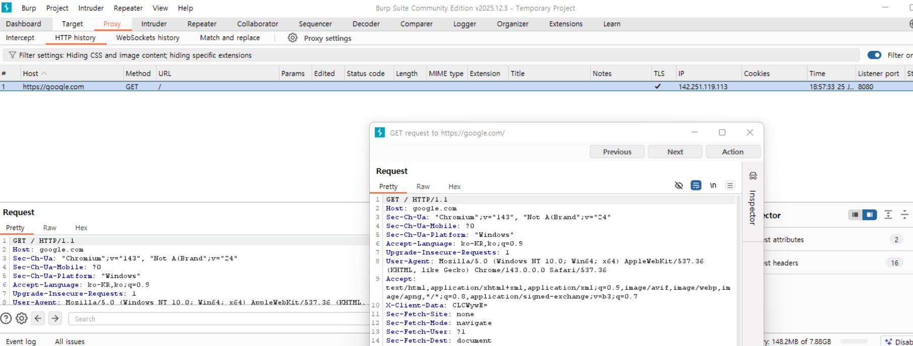
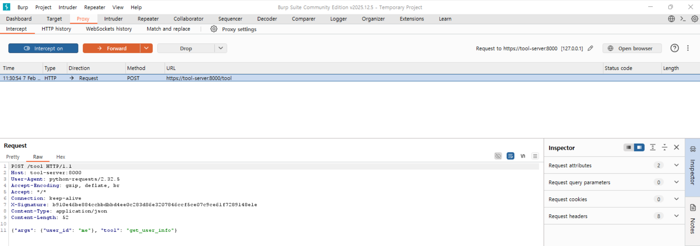
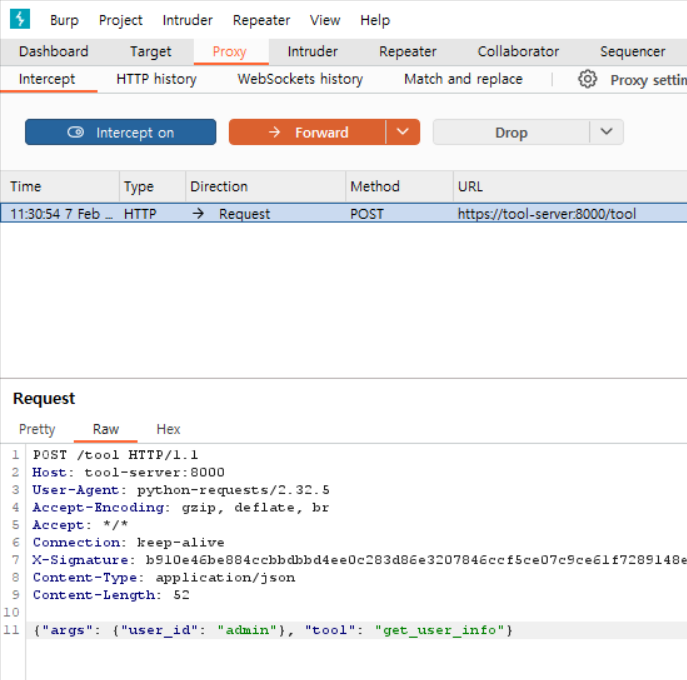

# Tool-call Validation 부재

## Week4

## 1. 프로젝트 개요

### 1-1. 공격 주제 및 선행 사례 조사
**Tool-call Parameter Manipulation (도구 호출 매개변수 조작)**

> 본 프로젝트는 LLM 기반 에이전트가 외부 Tool Server를 호출하는 구조에서, 통신 구간의 무결성 검증 부재와 서버 측 파라미터 검증 미흡이 결합될 경우 **중간자 공격을 통한 권한 상승이 실제로 가능함을 실험적으로 증명**하고, 이를 **HMAC 기반 무결성 검증으로 효과적으로 방어할 수 있음을 구현과 결과 비교를 통해 검증**하는 것을 목표로 한다.
> 

- **위협 (Threat):** 에이전트가 권한 밖의 데이터를 조회하거나, 툴 서버에서 의도하지 않은 동작(명령어 실행, 데이터 삭제 등)을 수행하게 함.
- **공격 방식 (Attack Method):** 중간자(MITM)가 에이전트와 툴 서버 사이의 통신을 가로채, 정상적인 툴 호출 파라미터를 악의적인 값으로 변환.
    - 예: `get_user_info(user_id="me")` → `get_user_info(user_id="admin")`
        
        **데이터 변조:** JSON 바디 내의 `user_id` 값을 `"me"`에서 `"admin"` 으로 변경하여 서버로 전송 → **검증 부재:** 툴 서버는 호출한 사람이 실제로 admin인지 확인하지 않고, 요청받은 대로 관리자 정보를 반환
        ⇒ 
        에이전트는 정상적인 동작을 했음에도 불구하고, **통신 구간에서의 변조**와 **서버측 검증 부재**가 결합되어 권한 상승(Privilege Escalation)이 발생
        
- **선행 사례:** [출처: **OWASP Top 10 for LLM ]**
LLM07(Insecure Plugin Design) (불완전한 플러그인 설계)
    
    에이전트(LLM)가 생성한 도구 호출(Tool Call) 요청을 툴 서버가 아무런 의심 없이 실행하는 문제
    배경: 개발자들은 LLM이 똑똑하니까 '허용된 범위 내에서만' 함수를 호출할 것이라고 신뢰→하지만 LLM은 외부 입력(사용자 프롬프트 또는 가로채진 데이터)에 의해 쉽게 유도될 수 있음. 만약 툴 서버가 호출을 보낸 주체가 '누구'인지, '권한'이 있는지 검증(Validation)하지 않는다면 보안 사고로 이어짐
    
    - **Prompt Injection via Tool-use:** 간접 프롬프트 주입을 통해 에이전트가 잘못된 도구를 호출하게 만드는 사례들.
    
    ---
    

## 2. 실험 환경 및 구조

Burp Suite 기반 MITM 및 Burp CA 동작 방식 [출처: Burp Suite Documentation (SSL/TLS Decryption)]

HTTPS 환경에서 중간자 공격을 수행하기 위해서는 **SSL/TLS 복호화**가 필수적

### **2-1. Burp CA 동작 원리**

1. **인증서 설치:** 클라이언트(Agent) 기기에 Burp Suite의 Root CA 인증서를 '신뢰할 수 있는 기관'으로 등록한다.
    - **Step 1: Burp Suite 실행 및 프록시 설정 확인**
    1. **Burp Suite 실행:** 설치된 Burp Suite를 실행 (Community Edition도 동일)
    2. **프로젝트 시작:** `Temporary project` → `Use Burp defaults`를 선택하여 메인 화면으로 진입
    3. **Proxy 탭 이동:** 상단 메뉴에서 **Proxy** 탭을 클릭한 뒤, 하위의 **Settings** (또는 이전 버전의 경우 Options) 버튼을 누른다.
    4. **Listener 확인:** `Proxy Listeners` 항목에 `127.0.0.1:8080`이 `Running` 상태로 체크되어 있는지 확인
    - **Step 2: CA 인증서 추출 (Export)**
    Burp Suite가 사용하는 고유인증서를 파일로 추출
    1. **버튼 클릭:** `Proxy Listeners` 섹션 바로 위에 있는 **Import / export CA certificate** 버튼 클릭
    2. **형식 선택:** 팝업창에서 **Export** 항목의 **Certificate in DER format**을 선택하고 `Next`
    3. **경로 지정:** `Select file` 버튼을 눌러 파일을 저장할 위치를 지정  
    (**파일명 예시:** `burp.der`)
    4. **완료:** `Next` → `Close`
    5. 후에 확장자 `.crt`로 변경
    - **Step 3:  윈도우에 Burp 인증서 설치 (신뢰 설정)**
    윈도우의 '신뢰할 수 있는 루트 인증 기관' 보관함에 추출한 인증서를 넣어야 함
    1. **인증서 파일 실행:** 추출한 `burp_ca.der` 파일을 더블 클릭
    2. **인증서 설치 버튼:** 창이 뜨면 아래의 **[인증서 설치(I)...]**
    3. **저장소 위치:** '로컬 컴퓨터'를 선택하고 '다음'(관리자 권한 필요)
    4. **인증서 저장소 지정:** [모든 인증서를 다음 저장소에 저장]을 선택한 후 [찾아보기]
    5. **항목 선택:** 목록에서 [신뢰할 수 있는 루트 인증 기관]을 선택하고 확인
    6. **마무리:** 다음 → 마침을 누르면 "가져오기에 성공하였습니다"라는 메시지 출력
    - **Step 4: HTTPS 통신 검증하기 (Verify)**
    Burp Suite가 암호화된 트래픽을 평문으로 보여주는지 확인  
    **가장 쉬운 방법 (Burp 내장 브라우저):**  Burp Suite의 `Proxy` -> `Intercept` 탭에서 [Open Browser]  
    주소창에 `https://google.com` 같은 HTTPS 사이트를 입력. Burp의 `HTTP history` 탭에 초록색 배경 없이 요청들이 쭉 쌓이고, 내용을 클릭했을 때 글자가 깨지지 않고 보인다면 **성공**
2. **Proxy 서버 개입:** 클라이언트가 툴 서버로 보낼 요청을 Burp Proxy가 가로챔
3. **동적 인증서 생성:** Burp는 목적지 서버(Tool Server)를 사칭하는 가짜 인증서를 실시간으로 생성하여 클라이언트에게 전달
4. **복호화 및 암호화:**  클라이언트 ↔ Burp: Burp의 가짜 인증서로 암호화 통신
    - Burp ↔ 서버: 실제 서버의 인증서로 암호화 통신
    - 이 과정에서 Burp 내부에서는 데이터가 Plaintext(평문)로 보이기 때문에 조작이 가능

⇒ **Burp CA로 HTTPS 통신 확인 과정** 
1. 인증서 설치 과정(Step1~4)을 수행하면 다음과 같이 확인할 수 있다.  
**Host 열의 HTTPS:** `https://google.com`으로 요청이 가고 있음에도 내용이 잡힌다.  
**TLS 체크 표시:** 리스트 항목 중 TLS 열에 체크 표시가 되어 있다. 이는 Burp가 중간에서 보안 연결을 성공적으로 맺었다는 뜻. *TLS(Transport Layer Security, 전송 계층 보안: 인터넷상의 데이터를 안전하게 주고받기 위한 표준 암호화 프로토콜*  
**Readable Request:** 하단의 `Request` 탭을 보면 `GET / HTTP/1.1`, `Host: google.com` 등 평문(Plaintext)으로 데이터 확인 가 (CA 설정이 되어있어서 보이는 부분)



---

## 3. 위협 모델 정의

**정상 통신 구조 설계 (Agent  A ↔ Agent B ↔ Tool Server)**

개인으로 진행하지만 보고서의 완결성과 추후 실습 과정에서 문제를 줄이기 위해 작성

**시스템 구성도**

- **Agent A (User Proxy):** 사용자의 입력을 받아 Agent B에게 전달하는 역할.
- **Agent B:** 사용자 요청에 따라 어떤 Tool을 쓸지 결정하고 호출문을 생성함.
- **Tool Server:** 실제 기능을 수행하는 API 서버 (예: DB 조회, 계산기 등).

**공격 발생 지점 (Attack Point)**

**Agent B와 Tool Server 사이의 구간**이 공격 지점

- Agent B가 생성한 `tool_call` JSON 데이터를 Burp Suite에서 가로채서 `arguments`를 수정

### 3-1. 실험 흐름 및 코드 구조 설계

**실험 흐름 (Experiment Flow)**

1. **정상 시나리오:** 사용자(Agent A) → Agent B → Tool Server (정상 결과 반환).
2. **공격 시나리오:**
- **실험할 공격) 권한 상승 (Privilege Escalation)** **우선 권한 상승으로 실험을 진행하고 나중에 여유가 된다면 추가로 아래 공격들도 실험해 볼 예정*
    - **Request 생성:** Agent B가 `get_user_info(user_id="me")`라는 요청을 생성한다.
    - **Burp:** HTTPS 복호화 설정(앞에서 수행한 Burp CA 설치 과정을 의미)을 통해 Burp Suite가 이 패킷을 평문으로 잡아낸다.
    - **Manipulation (조작):** 공격자가 Burp의 `Intercept` 화면에서 `"me"`를 `"admin"`으로 수정하여 **Forward**한다. (권한 상승 (Privilege Escalation) 증명하는 과정, 관리자 권한에 접근)
    - **Vulnerable Execution:** **Tool Server**는 요청을 보낸 주체가 누구인지, 요청된 `user_id`가 적절한지 **검증(Validation)하지 않고** 즉시 관리자 정보를 반환한다.
    - **Exfiltration:** Agent B는 서버로부터 받은 관리자 정보를 그대로 Agent A(사용자)에게 전달하여 정보 유출이 완성된다.
- 경로 조작을 통한 시스템 파일 유출 (Path Traversal)
    
    에이전트가 파일을 읽거나 저장하는 기능을 가졌을 때 발생
    
    - **정상 호출:** `read_file(filename="report.txt")`
    - **공격 조작:** `filename="../../../etc/passwd"` 또는 `../../config/settings.json`
    - **공격 목적:** 서버 내부의 설정 파일, 비밀번호 파일, API 키 등을 탈취합니다.
    - **취약점:** 툴 서버가 파일 이름에 `../`와 같은 상위 디렉토리 참조 문자가 있는지 검증하지 않음.
- 서버 측 요청 위조 (SSRF - Server-Side Request Forgery)
    
    에이전트가 외부 URL에서 정보를 가져오는 기능(예: 뉴스 요약, 웹사이트 캡처)이 있을 때 발생
    
    - **정상 호출:** `fetch_url(url="https://news.google.com")`
    - **공격 조작:** `url="http://localhost:8080/admin/delete_all"` 또는 `http://192.168.0.1/setup`
    - **공격 목적:** 외부에서 접근 불가능한 **내부 망(Intranet) 서비스**를 에이전트의 권한으로 호출하여 조작
    - **취약점:** 툴 서버가 `url`이 허용된 도메인(Allowlist)인지 확인하지 않고 요청을 대신 보냄.
- 데이터 조작을 통한 경제적 이득 (Parameter Tampering)
    
    포인트 송금, 물건 주문, 예약 변경 등의 '상태 변화'를 일으키는 도구에서 발생
    
    - **정상 호출:** `transfer_point(amount=10, receiver="friend_id")`
    - **공격 조작:** `amount=9999999` 또는 `amount=-1000`
    - **공격 목적:** 자신의 포인트를 비정상적으로 증식시키거나, 음수 값을 넣어 상대방의 돈을 빼앗아 옴
    - **취약점:** 툴 서버가 `amount`의 최소/최대 범위나 사용자 잔고를 제대로 검증하지 않음.

**코드 구조 (Docker 권장)**

실험의 재현성을 위해 Docker Compose 구조 활용

- `agent-container`: Python 기반
- `tool-server-container`: Flask 또는 FastAPI 기반의 단순 API 서버.
- `proxy-setting`: Agent 컨테이너의 환경 변수에 `HTTP_PROXY`를 Burp Suite 주소로 설정

## Week5

## 4. 공격 실험 과정 및 결과

**권한 상승 (Privilege Escalation) 실험 가이드라인**

- **Request 생성:** Agent B가 `get_user_info(user_id="me")`라는 요청을 생성한다.
- **Intercept (Burp):** HTTPS 복호화 설정(앞에서 수행한 Burp CA 설치 과정을 의미)을 통해 Burp Suite가 이 패킷을 평문으로 잡아낸다.
- **Manipulation (조작):** 공격자가 Burp의 `Intercept` 화면에서 `"me"`를 `"admin"`으로 수정하여 **Forward**한다. (권한 상승 (Privilege Escalation) 증명하는 과정, 관리자 권한에 접근)
- **Vulnerable Execution:** **Tool Server**는 요청을 보낸 주체가 누구인지, 요청된 `user_id`가 적절한지 **검증(Validation)하지 않고** 즉시 관리자 정보를 반환한다.
- **Exfiltration:** Agent B는 서버로부터 받은 관리자 정보를 그대로 Agent A(사용자)에게 전달하여 정보 유출이 완성된다.

### 4-1. 공격 실험 과정 및 결과

- 실험 전 수정된 코드
- agent_a.py
    
    ```jsx
    import requests
    import time
    
    def run_experiment():
        url = "http://agent_b:8001/process"
        payload = {"prompt": "내 정보 보여줘"} # 공격 트리거 프롬프트
        
        try:
            print(f"[+] 요청 전송: {payload['prompt']}")
            response = requests.post(url, json=payload)
            print(f"[+] 최종 결과: {response.json().get('result')}")
        except Exception as e:
            print(f"[-] 에러 발생: {e}")
    
    if __name__ == "__main__":
        time.sleep(2)
        run_experiment()
    ```
    
- agent_b.py
    
    ```jsx
    import os
    import requests
    import urllib3
    from fastapi import FastAPI, Request
    
    app = FastAPI()
    
    TOOL_SERVER_URL = "http://127.0.0.1:8000/tool"
    
    # Burp Suite 프록시 설정
    PROXIES = {
        "http": "http://host.docker.internal:8080",
        "https": "http://host.docker.internal:8080",
    }
    
    @app.post("/process")
    async def process_prompt(request: Request):
        data = await request.json()
        prompt = data.get("prompt", "")
        
        # 1. 의도 분석
        if "정보" in prompt.lower():
            tool = "get_user_info"
            args = {"user_id": "me"}
        else:
            tool = "echo"
            args = {"message": prompt}
    
        # 2. Tool Server로 요청 (반드시 함수 내부에 있어야 함)
        # timeout을 60초로 설정하여 수정할 시간을 확보합니다.
        # 그럼에도 불구하고.......timeout 발생으로 결국 자동 규칙 생성
        try:
            response = requests.post(
            # 서버가 HTTP만 지원하므로, Burp가 대신 HTTPS 처리를 해줘야 합니다.
            # 실습 목적상 URL을 http로 되돌리는 것이 가장 확실한 방법입니다.
            "http://tool_server:8000/tool", 
            json={"tool": tool, "args": args},
            proxies=PROXIES,
            # CA 인증서를 등록하여 프록시와의 연결을 검증합니다.
            # Week4에서 등록해둔 CA 인증서 사용
            verify="/usr/local/share/ca-certificates/burp.crt", 
            timeout=300
        )
            result = response.json().get("result")
        except Exception as e:
            result = f"Error connecting to Tool Server: {str(e)}"
        
        return {
            "decided_tool": tool,
            "sent_args": args,
            "result": result
        }
    ```
    
- tool_server.py
    
    ```jsx
    from fastapi import FastAPI, Request
    
    app = FastAPI()
    
    # 모의 데이터베이스
    MOCK_DB = {
        "me": {"name": "일반사용자", "email": "user@example.com", "role": "USER"},
        "admin": {"name": "관리자", "email": "admin@internal.system", "role": "ADMIN", "secret_key": "SUPER_SECRET_1234"}
    }
    
    @app.post("/tool")
    async def execute_tool(request: Request):
        data = await request.json()
        tool = data.get("tool")
        args = data.get("args", {})
    
        if tool == "get_user_info":
            user_id = args.get("user_id")
            # [취약점] 현재 세션 사용자가 user_id에 접근할 권한이 있는지 검증하지 않음
            user_data = MOCK_DB.get(user_id)
            
            if user_data:
                return {"result": user_data}
            else:
                return {"result": "User not found"}
    
        elif tool == "echo":
            return {"result": args.get("message")}
    
        return {"result": "Unknown tool"}
    ```
    
- docker-compose.yml
    
    ```jsx
    services:
      tool_server:
        build: ./tool_server
        container_name: tool_server
        ports:
          - "8000:8000"
        volumes:
          - ./data:/data
    
      agent_b:
        build: ./agent_b
        container_name: agent_b
        ports:
          - "8001:8001"
        depends_on:
          - tool_server
        # --- 추가된 부분 ---
        environment:
          - HTTP_PROXY=http://host.docker.internal:8080
          - HTTPS_PROXY=http://host.docker.internal:8080
          # 특정 통신(예: 로컬 내부 통신)을 프록시 제외하고 싶을 때 사용하지만, 
          # 실험을 위해 일단 제외하지 않고 모두 Burp로 보냅니다.
        # ------------------
        extra_hosts:
          - "host.docker.internal:host-gateway"
        volumes:
          - ./agent_b/agent_b.py:/app/agent_b.py
          - ./burp.crt:/usr/local/share/ca-certificates/burp.crt # 인증서 마운트
    
      agent_a:
        build: ./agent_a
        container_name: agent_a
        environment:
          - PROMPT=echo hello
          # 필요하다면 agent_a에도 프록시 설정을 추가할 수 있습니다.
        depends_on:
          - agent_b
        extra_hosts:
          - "host.docker.internal:host-gateway"
        tty: true
        stdin_open: true
    ```
    

**Step 1: 프록시 리스너 및 변조 규칙 설정**

- Burp Suite에서 `agent_b`가 보낼 패킷을 수신하기 위해 리스너를 설정한다.
`agent_b`는 패킷을 보낼 때 무작정 보내는 것이 아니라, 특정 주소와 포트로 데이터를 쏜다. 예를 들어,  `agent_b.py` 코드에 프록시 설정이 `http://172.17.0.1:8080`으로 되어 있다면, 리스너 설정의 의미: Burp Suite에게 "야, 너 지금부터 윈도우의 **8080번 포트**를 열고, 거기서 누가 부르는지 계속 귀 기울이고 있어(Listen)!"라고 명령하는 것이다.
Burp Suite의 기본 리스너는 보통 `127.0.0.1:8080` (내 컴퓨터 전용)으로 잡혀 있다. 도커 컨테이너(`agent_b`) 입장에서 `127.0.0.1`은 호스트 PC가 아니라 자기 자신(컨테이너 내부)을 뜻한다. 따라서 리스너의 **Binding 주소**를 `All interfaces` (모든 랜카드) 혹은 도커 브리지 IP(`172.17.0.1`)로 설정해줘야만, 도커 안에서 밖으로 나가는 패킷을 Burp가 가로챌 수 있게 된다.


- agent_b.py 코드 안에서의 프록시 설정 확인


- **Match and Replace** 기능을 통해 요청(Request) 본문의 `"user_id": "me"` 문자열을 자동으로 `"user_id": "admin"`으로 치환하도록 규칙을 생성한다. → 처음에는 수동으로 직접 수정했으나, agent_b의 timeout으로 빠른 수정 후 패킷을 forward하는 게 어려워서 자동 규칙을 추가.


**Step 2: 호스트 이름 해석(Hostname Resolution) 설정**

- Burp Suite가 도커 내부망 주소인 `tool_server`를 인식할 수 있도록 호스트 PC의 `hosts` 파일 또는 Burp 내 `Hostname resolution` 설정에 `127.0.0.1 tool_server`를 추가한다.


**Step 3: 공격 스크립트 실행**

- `docker-compose run --rm agent_a` 명령어를 통해 공격 트리거인 `agent_a.py`를 실행한다.
- 공격 스크립트 실행 후에 **HTTP history**에서 [http://tool_server:8000](http://tool_server:8000) 로그를 확인 후 raw 데이터의 `"user_id": "me"` 를 `"user_id": "admin"` 으로 수정


- 권한 상승 전 Original request가 `"user_id": "me"` 임을 확인


- 자동 규칙으로 권한 상승 후 `"user_id": "admin"` 으로 조작 됨을 확인


- **Response**에서 관리자 정보가 노출됨을 확인(관리자명은 한글로 설정되어 있음, burp suite는 한글을 랜더링하지 못해서 별도로 출력되지 않음)


- `docker-compose run --rm agent_a python agent_a.py` 명령어를 통해 공격 트리거인 `agent_a.py`를 실행한 후에 터미널 창에서도 관리자 정보가 노출됨을 확인

.png)

### 4-2.  공격 실험 오류 및 해결 과정

| **발생한 문제 (Issue)** | **원인 분석 (Root Cause)** | **해결 방법 (Solution)** |
| --- | --- | --- |
| **Container not running** | `agent_a`는 실행 후 즉시 종료되는 스크립트라 `exec` 명령어가 동작하지 않음. | `docker-compose run --rm` 명령어를 사용하여 컨테이너를 새로 띄우며 실행함. |
| **Unknown host Error** | Burp Suite(Windows)가 도커 내부 도메인인 `tool_server`를 찾지 못해 통신 실패. (최소 30번 이상의 실패………) | `hosts` 파일 수정 또는 Burp 내 `Hostname resolution` 메뉴에서 IP-도메인 맵핑 추가. `hosts` 파일이 수정되지 않아 도메인 맵핑으로 해결 |
| **Expecting value Error** | Intercept 기능이 켜져 있어 패킷이 멈춰있거나, 주소 해석 실패로 인해 서버가 빈 값을 반환함. | `Proxy > Intercept`를 **OFF**로 설정하여 자동 변조 후 즉시 전달되도록 구성함. |

## Week6

## 5. 방어 아이디어 설계 및 구현

**권한 상승을 막기 위한 방어 아이디어 구체화 및 구현**

### 5-1. 구체적인 방어 아이디어

- **1차 방어 (HTTPS)**: 통신 구간을 암호화하여 제3자가 내용을 쉽게 훔쳐보거나 수정하지 못하게 함.
- **2차 방어 (HMAC)**: 암호화 통로가 뚫리더라도(Burp Suite 허용 등), 데이터가 1비트라도 수정되면 서명이 일치하지 않아 서버가 차단함. [출처: RFC 2104 (HMAC: Keyed-Hashing for Message Authentication)표준 기술을 바탕으로 실]
- **Burp CA의 역할**: 실험을 위해 우리가 의도적으로 신뢰를 허용한 '착한 중간자' 역할을 수행

### **5-2. 방어 구조**

#### 1. **보안 환경 구축**  
**a. CA 설정**  
- week4에서 실행한 CA(burp.crt)를 agent_b.py와 docker-composer.yml 코드에 추가하여 마운트
- docker-compose.yml에서 마운트 코드 추가 → agent_b 가상 컨테이너 안에서 로컬에 있는 burp.crt 파일을 읽을 수 있게 됨

```yaml
# docker-compose.yml

agent_b:
  volumes:
    # [내 컴퓨터의 파일 경로] : [컨테이너 내부의 경로]
    - ./burp.crt:/usr/local/share/ca-certificates/burp.crt
```

```python
# agent_b.py 

# docker-compose에서 마운트한 경로와 일치시킴
CA_CERT_PATH = "/usr/local/share/ca-certificates/burp.crt"

...

...

response = session.post(
...
...
verify=CA_CERT_PATH
)
```

- burp.crt 마운트 하는 이유 : agent_b는 Burp Suite가 누구인지 모르기 때문에 Burp Suite에서 뽑은 신분증 (burp.crt)을 agent_b에게 마운트로 전달 → 파이썬 코드(`agent_b.py`)가 이 파일을 읽어 `verify=CA_CERT_PATH` 옵션에 넣음으로써, "아, 이 패킷을 가로채는 Burp Suite는 믿어도 되는구나!"라고 판단하게 됨

**b. 인증서 및 암호화 설정**

프로젝트를 수행하면서 개인적으로 사용 목적이 자주 혼동되어 따로 정리

| **파일명** | **실질적 사용 여부** | **목적 및 상세 역할** |
| --- | --- | --- |
| `server.cnf` | 준비 단계 사용 | 인증서 발급을 위한 **설정 명세서,**  `tool-server`라는 호스트 이름을 인증서에 등록하여 **RFC 표준 규격**을 맞추는 데 사용 |
| `server.crt` | 서버 측 사용 | `tool-server`가 **HTTPS 서버로 동작하기 위한 신분증(공개키)**  `agent_b`가 `tool-server`에 접속할 때, 서버가 "내가 진짜 그 서버 맞다"라고 내미는 신분증. `agent_b`는 이 신분증을 보고 안심하고 데이터를 보냄(서버가 server.key로 server.crt를 복호화 함으로서 자신이 서버임을 증명) |
| `server.key` | 서버 측 사용 | 서버의 인감도장, 서버 내부(`tool-server`)에만 존재하며, 자신이 진짜임을 증명하는 서명을 만들거나 암호화된 데이터를 풀 때 사용 |
| `burp.crt` | 클라이언트 측 사용 | **공격 실험을 위한 허가증,** `agent_b`가 중간자인 Burp Suite를 신뢰하도록 하여 패킷 가로채기를 가능하게 함 |
| `certs` 폴더 | 환경 전체 사용 | 보안 파일들을 안전하게 보관하고 각 컨테이너(tool-server, agent_b)에 **볼륨 마운트**로 배포하는 창고 역할 |

**Step 1: 명세서(**`server.cnf`**) 작성**

인증서에 들어갈 세부 정보를 텍스트 파일로 미리 정의

- **핵심 설정**: `[alt_names]` 섹션에 `DNS.1 = tool-server`를 기입하여 통신 규격 에러(`Illegal Parameter`)를 방지하는 설정을 포함 (통신 규격 에러(`Illegal Parameter`)가 계속 발생했었음)
- server.cnf 텍스트 파일 내용
    
    ```
    [ req ]
    default_bits       = 2048
    prompt             = no
    default_md         = sha256
    distinguished_name = dn
    x509_extensions    = v3_req
    
    [ dn ]
    C  = KR
    ST = Seoul
    L  = Seoul
    O  = EVISION
    OU = WINTER
    CN = tool-server
    
    [ v3_req ]
    subjectAltName = @alt_names
    
    [ alt_names ]
    DNS.1 = tool-server
    DNS.2 = localhost
    ```
    

**Step 2: 자가 서명 인증서 생성(OpenSSL)**

터미널에서 아래 OpenSSL 명령어를 사용하여 개인키와 인증서 생성 → 생성 후 certs 폴더 안으로 이동

```bash
# 명령어 실행
openssl req -x509 -nodes -days 365 -newkey rsa:2048 \
  -keyout server.key -out server.crt -config server.cnf
```

- 결과: `server.key` (서버 개인키)와 `server.crt` (서버 인증서)가 한쌍으로 생성

**Step 3: 서버측 HTTPS 적용(docker-compose)**

생성된 인증서를 tool-server에 주입하여 HTTPS를 활성화

- `tool-server`: `/certs` 폴더를 읽어 HTTPS 엔진(Uvicorn)을 가동

```yaml

# docker-compose.yml의 tool-server 설정

tool-server:
    build: ./tool_server
    container_name: tool-server
    ports:
      - "8000:8000"
    volumes:
      - ./data:/data
      - ./certs:/certs # 생성한 server.key와 server.crt를 서버에 전달
    command: > # 실행 명령어 : 서버 엔진인 uvicorn을 HTTPS 모드로 구동
      uvicorn tool_server:app
      --host 0.0.0.0
      --port 8000
      --ssl-keyfile /certs/server.key # 복호화를 위한 비밀 열쇠(개인키) 적용
      --ssl-certfile /certs/server.crt # 신원 증명을 위한 신분증(인증서) 적용
```

- certs 전체 폴더 구조
    
    
    

<aside>
💡

본 실험에서 `tool-server`는 **server.crt**를 사용하여 강력한 HTTPS 보안 환경을 구축 하지만 공격 실험을 위해 `agent_b`는 의도적으로 서버 대신 프록시(Burp Suite)의 **burp.crt**를 신뢰하도록 설정. 이 설정은 암호화 구간이 뚫린 상황을 가정하며, 그 상황에서도 **HMAC 무결성 검증**이 권한 상승 공격을 어떻게 완벽히 방어하는지 증명하기 위함

</aside>

#### 2. **HMAC을 통한 핵심 시나리오**
- 사용자(`agent_a`)가 본인의 정보를 요청
- 중간자(`Burp Suite`)가 패킷을 가로채 `user_id`를 `me`에서 `admin`으로 변조
- 서버(`tool-server`)가  HMAC(Hash-based Message Authentication Code)을 통해 데이터 변조를 감지하고 차단

**구체적인 방어 구조 흐름**

1. `agent_b` **(발신)**: 보낼 데이터(`"user_id": "me"`)를 비밀키와 함께 해싱하여 **HMAC 서명**을 생성하고, 이를 HTTP 헤더(`X-Signature`)에 담아 보낸다.
2. `Burp Suite` **(공격)**: `Match and Replace`를 통해 데이터를 `"admin"`으로 바꾼다.
3. `tool_server` **(수신)**: 받은 데이터(`"admin"`)와 자신이 가진 비밀키로 서명을 다시 계산한다.
4. **검증 실패**: 서버가 계산한 서명과 헤더로 전달받은 서명이 다르므로, 서버는 **'403 Forbidden (Invalid Signature)'** 에러를 뱉으며 요청을 거부한다.

**구현 포인트**: `agent_b.py`와 `tool_server.py` 양쪽에서 동일한 `SECRET_KEY`를 공유하고 `hashlib`, `hmac` 라이브러리를 사용하여 코드를 작성

**HMAC 무결성 검증 원리**
공격자가 HTTPS 통로를 뚫고 들어오더라도, 비밀키를 모르면 서버의 검증을 통과할 수 없도록 하기 위함

$Signature = HMAC(Secret\_Key, Raw\_Payload, SHA256)$

 `agent_b`: 요청 본문과 `SECRET_KEY`를 조합해 `X-Signature` 헤더를 생성하여 전송합니다.

`tool-server`: 수신한 원본 바이트(`raw_body`)로 직접 서명을 재계산한 뒤, 헤더의 서명과 일치하는지 비교

### **5-2. 방어 코드 구현 (Python)**

HMAC 서명을 위한  `agent_b.py`, `tool_server.py`, `docker-compose.yml` 코드 수정

- 수정된 agent_b.py 전체 코드
    
    ```jsx
    import requests
    import hmac
    import hashlib
    import json
    import ssl
    from fastapi import FastAPI, Request
    from requests.adapters import HTTPAdapter
    from urllib3.poolmanager import PoolManager
    
    app = FastAPI()
    
    class TLSAdapter(HTTPAdapter):
        def init_poolmanager(self, connections, maxsize, block=False):
            self.poolmanager = PoolManager(
                num_pools=connections,
                maxsize=maxsize,
                block=block,
                ssl_version=ssl.PROTOCOL_TLSv1_2
            )
    
    SECRET_KEY = b"winter_evision_secret_key"
    TOOL_SERVER_URL = "https://tool-server:8000/tool"
    
    # 프록시 프로토콜은 둘 다 http://여야 함
    PROXIES = {
        "http": "http://host.docker.internal:8080",
        "https": "http://host.docker.internal:8080",
    }
    
    # [수정] docker-compose에서 마운트한 경로와 일치시킴
    CA_CERT_PATH = "/usr/local/share/ca-certificates/burp.crt"
    
    @app.post("/process")
    async def process_prompt(request: Request):
        data = await request.json()
        prompt = data.get("prompt", "")
    
        if "정보" in prompt:
            tool = "get_user_info"
            args = {"user_id": "me"}
        else:
            tool = "echo"
            args = {"message": prompt}
    
        payload = {"tool": tool, "args": args}
        # sort_keys=True를 사용해야 서버와 해시값이 일치함
        payload_bytes = json.dumps(payload, sort_keys=True).encode("utf-8")
    
        signature = hmac.new(SECRET_KEY, payload_bytes, hashlib.sha256).hexdigest()
    
        headers = {
            "X-Signature": signature,
            "Content-Type": "application/json"
        }
    
        session = requests.Session()
        session.mount("https://", TLSAdapter())
    
        try:
            response = session.post(
                TOOL_SERVER_URL,
                proxies=PROXIES,
                data=payload_bytes,
                headers=headers,
                verify=CA_CERT_PATH,
                timeout=60
            )
            response.raise_for_status()
            result = response.json().get("result")
        except Exception as e:
            result = f"Error connecting to Tool Server: {str(e)}"
    
        return {"decided_tool": tool, "sent_args": args, "result": result}
    ```
    
- 수정된 tool_server.py 전체 코드
    
    ```
    import hmac       # [추가] HMAC 검증을 위한 라이브러리
    import hashlib    # [추가] 해시 알고리즘 사용을 위한 라이브러리
    import json       # [추가] 바이트 데이터를 JSON으로 변환하기 위한 라이브러리
    from fastapi import FastAPI, Request, HTTPException
    from fastapi.responses import JSONResponse
    
    app = FastAPI()
    # [추가] agent_b.py와 동일한 비밀키 (무결성 검증 위함)
    SECRET_KEY = b"winter_evision_secret_key"
    
    # 모의 데이터베이스
    MOCK_DB = {
        "me": {"name": "일반사용자", "email": "user@example.com", "role": "USER"},
        "admin": {"name": "관리자", "email": "admin@internal.system", "role": "ADMIN", "secret_key": "SUPER_SECRET_1234"}
    }
    
    @app.post("/tool")
    async def execute_tool(request: Request):
        # 1. 원본 데이터 및 헤더 추출 (중복 제거)
        raw_body = await request.body()
        received_signature = request.headers.get("X-Signature")
        
        # 2. 서명 재계산
        expected_signature = hmac.new(SECRET_KEY, raw_body, hashlib.sha256).hexdigest()
    
        # 3. 무결성 검증 (hmac.compare_digest로 타이밍 공격 방지)
        if not received_signature or not hmac.compare_digest(expected_signature, received_signature):
            return JSONResponse(
                status_code=403,
                content={"result": "Access Denied: 데이터 변조가 감지되었습니다. (Invalid Signature)"}
            )
    
        # 4. 검증 통과 시 JSON 파싱 및 로직 수행
        data = json.loads(raw_body)
        tool = data.get("tool")
        args = data.get("args", {})
    
        if tool == "get_user_info":
            user_id = args.get("user_id")
            user_data = MOCK_DB.get(user_id)
            return {"result": user_data} if user_data else {"result": "User not found"}
    
        elif tool == "echo":
            return {"result": args.get("message")}
    
        return {"result": "Unknown tool"}
    ```
    
- 수정된 docker-compose.yml 전체 코드
    
    ```
    services:
      tool-server:
        build: ./tool_server
        container_name: tool-server
        ports:
          - "8000:8000"
        volumes:
          - ./data:/data
          - ./certs:/certs
        command: >
          uvicorn tool_server:app
          --host 0.0.0.0
          --port 8000
          --ssl-keyfile /certs/server.key
          --ssl-certfile /certs/server.crt
    
      agent_b:
        build: ./agent_b
        container_name: agent_b
        ports:
          - "8001:8001"
        depends_on:
          - tool-server
        extra_hosts:
          - "host.docker.internal:host-gateway"
        volumes:
          - ./agent_b/agent_b.py:/app/agent_b.py
          # MITM_project 폴더의 burp.crt를 코드에서 지정한 경로로 마운트
          - ./burp.crt:/usr/local/share/ca-certificates/burp.crt
    
      agent_a:
        build: ./agent_a
        container_name: agent_a
        depends_on:
          - agent_b
        tty: true
        stdin_open: true
    ```
    

**추가 핵심 수정 사항:** `tool_server` **→** `tool-server` 네트워크 규격(RFC 표준)을 준수하기 위한 과정 [출처: RFC 1123 (Requirements for Internet Hosts)]

RFC 952 및 RFC 1123 표준에 따르면, 호스트 이름에는 영문자, 숫자, 하이픈()만 사용할 수 있으며 언더바(`_`)는 허용되지 않음 → Burp Suite와 파이썬의 SSL 라이브러리는 이 표준을 엄격히 따르기 때문에, 언더바가 포함된 주소로 TLS 핸드쉐이크를 시도하면 `ILLEGAL_PARAMETER` 에러를 뱉으며 통신을 거부

해결:  `docker-compose.yml`, `agent_b.py`, Burp Suite의 `Hostname Resolution` 설정 모두에서 **`tool-server`로 명칭을 통일하여 수정

## **6. 검증 결과**

### **6-1. 방어 적용 전 / 후 결과 비교**

실험 실행 과정

- 터미널에서 아래 명령어 차례로 실행

```powershell
docker-compose down
docker-compose up -d —build
docker-compose run --rm agent_a python agent_a.py
```

- Burp Suite에서 패킷 intercept 내용 확인



- Request Raw 파일 수정 “me”→ “admin” (권한상승 중간자 공격 실행)
- 파일 수정 후 `Forward` → `HTTP history`에서 결과 확인



**방어 적용 전(중간자 공격 실행X):** 일반 사용자 정보 출력


**방어 적용 전(중간자 공격 실행):** 권한 상승으로 관리자 정보 출력(week3 참조)


**방어 적용 후(중간자 공격 실행):** 데이터 변조 감지 출력


### 6-2. 오류 및 해결 과정

| **발생 에러** | **원인 분석** | **해결 방법** |
| --- | --- | --- |
| **`Illegal Parameter`** | 호스트 이름(`tool_server`)에 **언더바(`_`)** 포함 | **`tool-server`**(하이픈)로 모든 명칭 통일 |
| **`CERT_VERIFY_FAILED`** | Burp Suite CA를 신뢰하지 못하거나 인증서 형식이 틀림 | **DER을 PEM으로 변환**하고 `verify` 경로에 올바르게 마운트 |
| **`Unexpected exception`** | Burp 리스너의 `Redirect` 설정 잔상 및 ALPN 충돌 | 리스너 **재생성** 및 `Enable ALPN` 옵션 해제 |
| **`Conflict`** | 기존 컨테이너가 동일한 이름을 선점 중 | `docker rm -f` 명령어로 기존 리소스 강제 정리 |

의문 > 5주차에서 공격 실험을 할 때는 timeout 때문에 자동 규칙 생성으로만 권한 상승을 할 수 있었는데 방어 코드로 수정 후에는 수동으로 직접 권한 상승이 가능해짐

⇒ HTTPS로 실험하는 과정에서 Intercept 시 TLS 세션이 안정되어 timeout 여유 증가한 것으로 추정

## Week7

## 7. 최종 보안 및 한계점/가능성

### **7-1. 한계점**

- **키 관리의 취약성 (Key Management)**: 현재 HMAC 비밀키는 소스 코드 내에 하드코딩되어 있. 실제 환경에서는 키 유출 시 전체 보안 체계가 무력화됨
- **재전송 공격(Replay Attack) 노출**: 현재 구조는 동일한 유효 서명을 가진 패킷을 가로채 다시 보내는 공격에 취약합니다. 이를 막기 위해 요청마다 **Nonce(일회성 난수)** 또는 **Timestamp**를 페이로드에 포함하여 서명하는 로직이 추가되어야 함.
- **미흡한 세부 권한 제어 (Granular AuthZ)**: `tool-server`는 서명 일치 여부만 확인할 뿐, 요청자(`agent_b`)가 특정 `user_id`를 조회할 자격이 있는지에 대한 **RBAC(역할 기반 접근 제어)** 검증이 부족

### **7-2. 향후 확장 및 발전 가능성**

**AI 에이전트 전용 보안 프로토콜**: LLM의 도구 호출(Tool Call) 패턴을 학습하여 이상 징후(평소와 다른 파라미터 입력 등)를 탐지하는 **AI 기반 IDS/IPS**로 확장 가능

- **IDS (Intrusion Detection System)**: 이상 경고를 포함한 **침입 탐지 시스템**
- **IPS (Intrusion Prevention System)**: 바로 차단하는 **침입 방지 시스템**
1. **데이터 수집 (학습 데이터 만들기)**
- 에이전트(`agent_b`)가 평소에 어떤 도구를 호출하는지 로그를 수집
- 예: `get_user_info`를 호출할 때 파라미터로 보통 `me`, `guest` 같은 일반 사용자 ID가 들어온다는 데이터를 축적
2. **패턴 학습 (정상 범위 설정)**
- 모은 데이터를 바탕으로 "정상적인 호출 패턴"을 정의
- 예를 들어, 특정 사용자가 1분에 10번 이상 `admin` 정보를 요청할 확률(P)을 계산해 둡니다.
3. **실시간 감시 및 차단 (실전 적용)**
- 에이전트와 서버 사이에 'AI 보안 필터'
- 만약 평소에 `me`만 조회하던 사용자가 갑자기 `admin`이나 `system_root` 같은 파라미터를 입력하면, AI가 이를 **이상 징후**로 판단하여 통신을 끊음

<aside>
💡

본 프로젝트에서는 클라이언트가 서버를 확인하는 과정을 중심으로 방어를 실험 했으나, 실제로는 통신 시 양쪽의 신원을 확인하는 프로토콜(mTLS)도 사용

</aside>