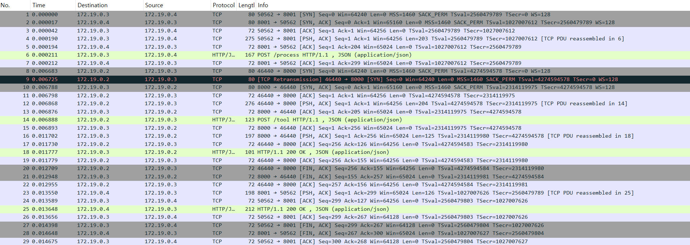
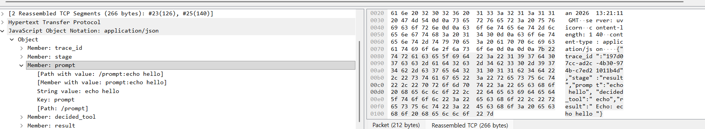

# Multi-Agent System

목표 : 멀티 에이전트 구조에서 에이전트 간 HTTP 평문 통신을 관찰하고, 에이전트의 내부 처리 과정(prompt / tool-call / response)이 네트워크 메시지 형태로 어떻게 외부에 드러나는지를 확인


## 1. 시스템 개요

Agent A : 사용자의 프롬프트를 담아 작업을 요청의 시작점

Agent B : 프롬프트를 분석하여 적절한 도구(read_file 또는 echo)를 결정하고 실행을 지시

Tool Server : 실제 파일 읽기나 에코 기능을 수행하고 결과를 반환

통신흐름
Agent A → (HTTP POST :8001) → Agent B → (HTTP POST :8000) → Tool Server


## 2. 주요 구현 내용

2.1 에이전트 판단 로직(Agnet B)
Agent B는 입력된 프롬프트에 특정 키워드("file")가 포함되어 있는지에 따라 실행할 도구를 결정
```# agent_b.py 핵심 로직
if "file" in prompt.lower():
    tool = "read_file" # 파일 읽기 도구 선택
else:
    tool = "echo"      # 에코 도구 선택
 ```


## 3. 문제 해결 및 디버깅 과정

### 3.1 문제 상황: Tool Server 응답 누락
초기 실행 시 Agent B까지 요청이 도달했으나, 최종 결과값이 비어있는 현상이 발생

해결 방법:
1. tool_server가 참조하는 파일 경로와 실제 마운트된 볼륨 내 파일(data/hello.txt)의 존재 여부 및 내용을 확인
2. 파일에 내용을 채워 넣고 경로를 일치시켜 해결

### 3.2 문제상황: 코드 수정 미반영(도구 선택 오류)
프롬프트를 "echo hello"로 변경했음에도 불구하고 계속해서 read_file 도구가 호출되는 문제

원인 및 해결:

원인 1: docker-compose.yml 환경 변수에 "file" 키워드가 포함된 문장이 고정되어 있었음 -> 환경 변수 수정으로 해결

원인 2: 코드를 수정했으나 컨테이너 이미지가 재빌드되지 않았음. -> docker-compose up --build 명령어를 사용하여 수정 사항을 반영


## 4. 네트워크 패킷 검증 방법
시스템의 정상 동작을 검증하기 위한 컨테이너 내부 네트워크 트래픽 캡쳐 및 분석

### 4.1 패킷 캡쳐 준비
컨테이너 내부에 tcpdump 설치
``` bash
docker exec -it week2-agent_b-1 tcpdump -i any
```
### 4.2 전체 통신 흐름 캡쳐
Agent A와 B 사이(8001번), Agent B와 Tool Server 사이(8000번)의 통신을 모두 확인하기 위해 두 포트를 동시에 캡처
1. 캡쳐 시작(별도의 터미널 이용)
```bash
docker exec -it -u root week2-agent_b-1 tcpdump -i any "port 8000 or port 8001" -w /tmp/final_capture.pcap
```
2. 트래픽 발생: ```docker-compose start agent_a```실행
3. 캡쳐 종료 ```Ctrl+C```
4. 파일 추출: 호스트머신(윈도우)으로 pcap 파일 복사
```docker cp week2-agent_b-1:/tmp/final_capture.pcap C:\Users\[사용자명]\Desktop\final_capture.pcap```

### 4.3 Wireshark 분석 결과
추출한 파일을 Wireshark로 열고 http 필터를 적용하여 분석

wireshark로 네트워크 http 패킷 캡쳐

### 4.4 HTTP Playload 내 JSON 필드 분석
최종 응답 패킷의 내부 구조를 분석하여, 각 에이전트가 공유하는 데이터 규격(Schema)이 정확히 구현되었는지 확인


trace_id: 분산 환경에서 하나의 요청을 추적하기 위한 고유 식별자

stage: 현재 처리 단계가 "result"임을 나타내며, 응답의 성격을 정의

prompt: 사용자가 입력한 원본 메시지("echo hello")를 보존하여 결과의 맥락을 제공

decided_tool: 에이전트가 판단한 도구명("echo")이 명시

result: 최종 실행 결과물("Echo: echo hello")이 담긴 핵심 데이터 필드

### 4.5 Prompt 값 변경에 따른 Tool-call의 동적 변화 분석

(1) 키워드 'file' 포함 시: read_file 호출
입력된 프롬프트의 키워드에 따라 Agent B가 의사결정을 내리고, 다른 도구를 호출하는 과정을 분석

프롬프트에 "file"이 포함되면 Agent B는 Tool Server에 "tool": "read_file"을 요청
이에 따라 Tool Server는 실제 파일의 내용인 "Hello, this is Agent B's file"을 반환


(2) 일반 텍스트 입력 시: echo 호출

동일한 구조 내에서 프롬프트가 "echo hello"로 바뀌면, Agent B의 로직에 의해 decided_tool이 "echo"로 자동 변경
결과값 또한 파일 내용이 아닌 텍스트를 복제한 응답으로 바뀐 것을 확인

## 5. 코드 상세 설명
Python의 FastAPI 프레임워크를 사용하여 비동기적으로 통신하며, 각 에이전트의 역할에 따라 다음과 같이 구현

### 5.1 Agent B: 의사결정 로직
Agent B는 시스템의 두뇌 역할을 하며, 사용자의 의도를 분석해 적절한 도구를 선택

```
@app.post("/process")
async def process_prompt(request: Request):
    data = await request.json() # Agent A로부터 JSON 데이터 수신
    prompt = data.get("prompt", "")
    trace_id = data.get("trace_id")

    # [로직 1] 규칙 기반 도구 선택 (Rule-based Selection)
    # prompt.lower()를 사용하여 대소문자 구분 없이 'file' 키워드를 감지
    if "file" in prompt.lower():
        tool = "read_file"
        args = {"path": "hello.txt"} # 파일 읽기 도구와 필요한 인자 설정
    else:
        tool = "echo"
        args = {"message": prompt}   # 에코 도구와 메시지 설정

    # [로직 2] Tool Server와 통신 (Inter-service Call)
    # 결정된 도구와 인자를 Tool Server(Port 8000)로 전달
    response = requests.post(TOOL_SERVER_URL, json={
        "tool": tool,
        "args": args
    })
```
trace_id를 유지함으로써 분산 환경에서 요청의 시작부터 끝까지를 추적(Tracing)할 수 있는 구조

### 5.2 Tool Server: 기능 실행
실제 연산을 수행하는 하위 시스템으로, 보안상 지정된 작업만 수행

``` @app.post("/tool")
async def execute_tool(request: Request):
    data = await request.json()
    tool = data.get("tool")
    args = data.get("args", {})

    # [기능 1] 파일 읽기 (File I/O)
    if tool == "read_file":
        path = args.get("path")
        # 컨테이너 내부의 /data 경로에 있는 파일을 읽어 반환
        with open(f"/data/{path}", "r") as f:
            result = f.read()
            
    # [기능 2] 메시지 에코 (Echo)
    elif tool == "echo":
        result = f"Echo: {args.get('message')}"
        
    return {"result": result}
```
    
```with open``` 구문을 사용하여 파일 읽기 후 자동으로 핸들을 닫도록 구현되어 자원 누수를 방지
```/data/```라는 특정 디렉토리 내에서만 파일을 읽도록 제한


