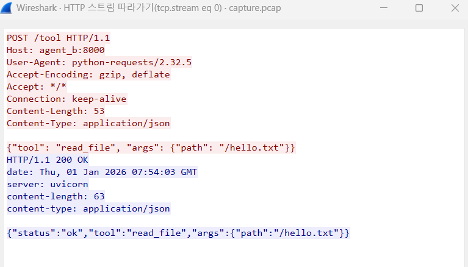

# week 1: Agent HTTP 통신 및 패킷 분석

## 1. 프로젝트 개요
Docker compose를 사용하여 Agent A(client)와 Agent B(Server)간의 JSON 데이터 통신을 구현

## 2. 폴더 및 파일 구성
week1-agent-http/: 프로젝트 루트 폴더
    agent_a/: 클라이언트 역할을 하는 에이전트 폴더
        agent_a.py: 서버에 JSON 데이터를 전송하는 Python 스크립트
        Dockerfile: Agent A의 실행 환경을 정의한 파일
    agent_b/: 서버 역할을 하는 에이전트 폴더
        tool_server.py: FastAPI를 사용해 HTTP POST 요청을 처리하는 서버
        Dockerfile: Agent B의 실행 환경을 정의한 파일입니다.
    docker-compose.yml: 두 컨테이너를 한꺼번에 관리하고 네트워크를 연결하는 설정 파일

## 3. 주요 코드 설명
### Agent A (Client)
requests 라이브러리를 사용하여 서버(http://agent_b:8000/tool)에 특정 도구 실행 요청(JSON)을 전송
<pre> # agent_a/agent_a.py
import requests
import time

# Agent B 서버로 도구 실행 요청(JSON) 전송
url = "http://agent_b:8000/tool" # Docker Compose 서비스 이름 사용
payload = {
    "tool": "read_file",
    "args": {"path": "/hello.txt"}
}

for i in range(1, 31):
    try:
        response = requests.post(url, json=payload)
        if response.status_code == 200:
            print(f"서버 응답: {response.json()}") # 서버로부터 받은 응답 출력
            break
    except:
        print(f"[{i}/30] 아직 서버 준비 안 됨... 재시도")
        time.sleep(1) </pre>

### Agent B (Server)
- FastAPI를 기반으로 /tool 엔드포인트를 열어두고, 들어온 JSON 데이터를 출력한 뒤 응답을 반환
- 서버(Agent B)는 FastAPI 프레임워크를 사용하여 구축 -> 에이전트 간의 JSON 데이터 교환을 효율적으로 처리하고, RESTful API 엔드포인트를 간결하게 구현하기 위함
- RESTful(Representational State Transfer): HTTP 주소(URL)와 HTTP 메소드(GET, POST 등)를 사용하여 데이터를 주고받는 가장 대중적인 규칙
<pre> # agent_b/tool_server.py
from fastapi import FastAPI, Request

app = FastAPI()

@app.post("/tool")
async def handle_tool(request: Request): 
# 받은 JSON 데이터 출력 및 응답 반환
    data = await request.json()
    print(f"받은 요청 : {data}")
    return {"status": "ok", "tool": data.get("tool"), "args": data.get("args")}</pre>
## 4. 실행 및 결과 확인
- Docker Desktop을 실행한 상태에서 아래 명령어로 전체 시스템 가동
`docker compose up --build`
- Agent A가 요청을 보내고 Agent B가 성공적으로 응답을 반환하는 것을 확인

Agent A가 서버로 부터 받은 JSON 응답({'status': 'ok', ...})을 출력하고 정상 종료

## 5. Wireshark 패킷 분석
가상 네트워크 인터페이스에서 발생한 POST /tool 패킷을 캡쳐하여 분석
필터: http 또는 tcp.port == 8000을 사용하여 트래픽을 선별



## 6. 패킷 캡쳐 과정
Windows 환경에서 Docker Desktop(WSL2 기반)을 사용할 경우, 컨테이너 간의 통신은 호스트 OS(Windows)의 네트워크 인터페이스를 거치지 않고 가상 리눅스 환경 내부의 브릿지에서만 발생

### 문제점
Windows에 설치된 Wireshark는 호스트의 네트워크 카드만 감시하므로, 내부 가상망에서 벌어지는 에이전트 간의 대화를 직접 포착할 수 없었음

### 해결책
가상 네트워크 내부에 직접 들어가 패킷을 가로챌 수 있는 별도의 캡처 도구(tcpdump)를 실행하여 패킷 파일(.pcap)을 생성 -> 이를 호스트로 추출하여 분석

- agent_b 컨테이너의 네트워크 모드에 접속하여 실시간 패킷을 감시하는 임시 컨테이너를 구동
```docker run --rm --net=container:agent_b_container kaazing/tcpdump -w /tmp/capture.pcap```

- Agent A를 실행하여 Agent B와 JSON 데이터를 주고받도록 유도

- 파일 추출 (docker cp): 컨테이너 내부 /tmp 폴더에 생성된 캡처 파일을 로컬 환경으로 복사
```docker cp agent_b_container:/tmp/capture.pcap ./capture.pcap```

- Wireshark 분석: 추출된 파일을 Wireshark로 불러와 필터링(http)을 통해 실제 통신 내용을 검증


