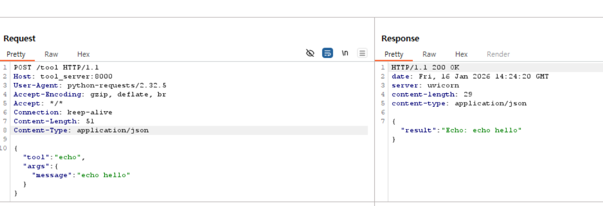
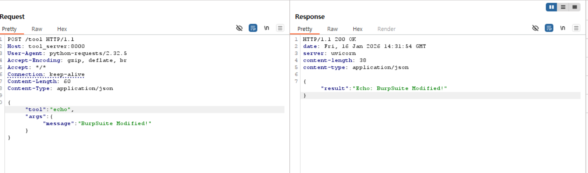

#  프록시(Burp Suite)를 이용해 MITM(Man-In-The-Middle) 테스트

## Proxy, Burp Suite 개념 학습 정리

### 1. 프록시(Proxy) 개념 정리
클라이언트와 서버 사이에서 중계 역할을 수행하는 서버 

#### 1-1. Forward Proxy
- 클라이언트 앞에 위치하여 외부로 나가는 요청을 중계
- 클라이언트의 IP를 숨기거나 내부망 보안 정책 적용에 사용

#### 1-2. Reverse Proxy
- 웹 서버 앞에 위치하여 클라이언트로 들어오는 요청을 서버로 전달함
- 로드 밸런싱, 보안 강화(WAF), 캐싱 기능 수행

#### 1-3. Transparent Proxy
- 사용자가 설정하지 않아도 패킷을 가로채서 중계함
- 클라이언트는 프록시의 존재를 인지하지 못함

### 2. Burp Suite
- 웹 애플리케이션의 보안 취약점을 진단하고 분석하기 위해 전 세계 보안 전문가들이 사용하는 통합 테스팅 플랫폼
- 단순히 패킷을 보는 것을 넘어, 요청을 변조하고, 자동화된 공격을 수행하며, 애플리케이션의 로직을 분석하는 다양한 도구들이 하나로 합쳐져 있음

- 통신 가시성 확보: 클라이언트(에이전트)와 서버 사이에 오가는 데이터가 암호화되어 있거나 숨겨져 있어도, 중간에서 이를 평문으로 확인하여 통신 구조를 파악할 수 있음

- 데이터 무결성 테스트: 정상적인 요청을 가로채 내용을 수정(Tampering)했을 때, 서버가 이를 어떻게 처리하는지 확인하여 보안 취약점을 찾아낼 수 있음

- 취약점 탐지: SQL Injection, XSS, 불충분한 인증 등 웹 애플리케이션이 가진 다양한 보안 약점을 수동 또는 자동으로 탐지

- **Burp Suite는 단순한 중계 서버를 넘어 '인터셉팅 프록시(Intercepting Proxy)'라는 고유한 성격을 가짐**

    1. 인터셉팅 프록시 (Intercepting Proxy)
    일반적인 프록시는 데이터를 전달하는 것에 집중하지만, Burp Suite는 데이터를 '중간에 멈춰 세울 수 있는' 기능

    동작 방식: 패킷이 서버로 가기 전 잠시 멈추게 하고(Intercept On), 사용자가 데이터를 수정한 뒤 'Forward' 버튼을 눌러야만 비로소 서버로 전달됨

    2. 명시적 포워드 프록시 (Explicit Forward Proxy)
    이번 실습 환경(Docker)을 기준으로 보면, Burp Suite는 명시적 포워드 프록시 역할을 수행

    Forward: 클라이언트(Agent A, B)가 외부(또는 다른 서비스)로 나가는 요청을 대신 전달

    Explicit (명시적): 사용자가 직접 코드나 환경 변수(HTTP_PROXY)를 통해 "Burp Suite를 거쳐가라"고 경로를 지정해 주었기 때문

### 3. Burp Suite 핵심 기능

#### 3-1. Intercept
- 실시간으로 오가는 HTTP 요청(Request) 및 응답(Response)을 중간에 멈춰 세우는 기능
- 패킷이 서버로 전달되기 전에 데이터를 수정하거나, 서버의 응답을 클라이언트에 도달하기 전에 변조할 때 사용

#### 3-2. HTTP History
- 프록시를 통과한 모든 HTTP 통신의 기록을 차례대로 보여주는 로그 탭
- 통신이 정상적으로 이루어지는지(200 OK), 어떤 호스트(agent_b, tool_server)와 통신하는지 전반적인 흐름을 파악하는 데 유용

#### 3-3. Repeater
- 특정 요청을 복사하여 수동으로 수정하고 반복해서 재전송할 수 있는 도구
- Raw 탭에서 JSON 데이터 내부의 prompt나 tool-call 인자값을 직접 수정하여 서버의 반응 변화를 관찰할 때 핵심적으로 사용

### 4. 실습
#### 4-1. a ↔ b 사이, b ↔ server 사이에 Burp Suite 프록시 연결 
 환경 변수(HTTP_PROXY)를 사용하여 패킷이 호스트의 Burp Suite(host.docker.internal:8080)를 반드시 거치도록 설계
```
# agent_a.py
# URL은 도커 서비스 이름을 그대로 사용 (Burp DNS 설정 필요)
AGENT_B_URL = "http://agent_b:8001/process"
```
``` 
# agent_b.py
TOOL_SERVER_URL = "http://tool_server:8000/tool"
```


#### 4-2. HTTP history에서 요청 2개(a↔b, b↔tool) & 대응하는 response
week2 코드 활용


#### 4-3. epeater 기능으로 prompt, tool-call, response 변조



